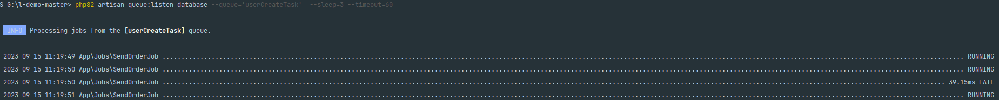
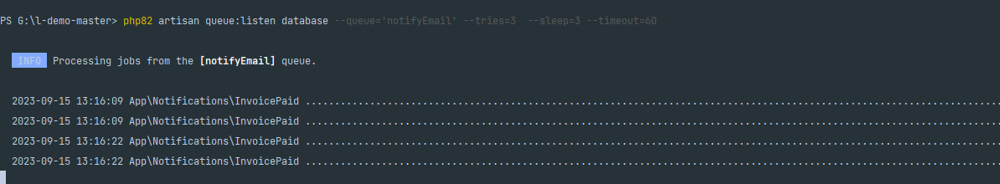

## Telescope 调试工具 查看所有开发的消息 env 为local  其他需要密码 授权访问
http://json-admin.com/telescope/requests

## GeoIP 根据ip 获取用户地理位置信息
- 获取最新的ip的定位数据库 参考 (https://learnku.com/laravel/t/39865)
- php artisan geoip:update 下载最新的 geoip.mmdb 数据库文件

## 使用说明
- 打开route/web.php 找到k的路由
- [开启一个创建用户的消息队列]
- 访问 http://json-admin.com/k
- 在控制台执行 php artisan queue:listen database --queue='userCreateTask' --tries=3  --sleep=3 --timeout=60
- 这是通过数据库作为存储驱动的延时消息队列
- 

## 发送邮件通知 可以设置延时
- 打开route/web.php 找到d的路由
-  [开启发送邮件通知消息队列]
- 访问 http://json-admin.com/k
- 在控制台执行 php artisan queue:listen database --queue='notifyEmail' --tries=3  --sleep=3 --timeout=60
- 
